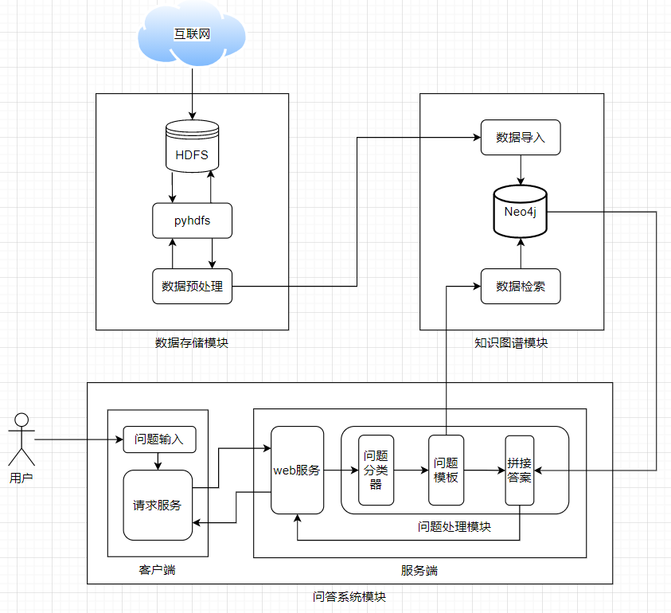
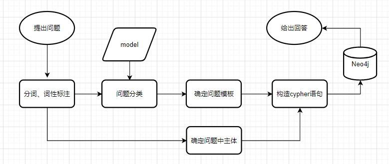

# QASystemOnMovieKG
基于知识图谱的电影信息问答系统

## 使用方式

1. 安装环境

```shell
pip install -r requirment.txt
```

2. 启动Neo4j，并修改程序中数据库连接的配置
3. 导入数据

将data下的csv文件复制到启动的Neo4j数据库目录下的import文件夹，运行

```shell
python data2neo4j.py
```

4. 运行服务端程序

```shell
python server.py
```

5. 新开一个终端，运行客户端程序

```shell
python client.py
```

## 系统架构






## 代码说明

- data文件夹

已处理好的csv文件，可以直接导入neo4j

- question文件夹

进行问题分类的训练数据、jieba自定义用户词典、问题模板等

- data2neo4j.py

用来把csv文件导入neo4j

- hdfs.py

使用python操作HDFS

- question_classification.py

问题分类器

- question_template.py

定义不同类型问题的cypher语句、回答方式，返回答案

- process_question.py

问答模块的主程序

- test.py

测试程序，可以回答单个问题

- server.py

服务端程序，开启web服务，调用问答模块的主程序

- client.py

客户端程序，请求web服务并返回答案


